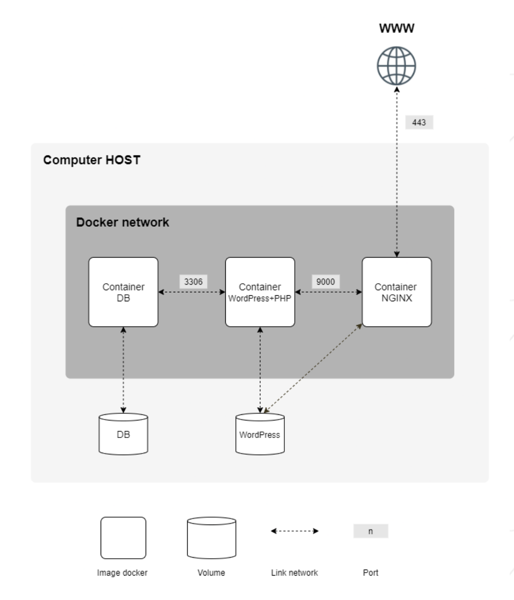

# Inception  📝
This project is a part of 42Network cursus, and it aims to broaden the knowledge of system administration by using Docker. You will virtualize several Docker images.
  
## General guidelines  💬
This project consists in having you set up a small infrastructure composed of different services under specific rules.
* Each Docker image must have the same name as its corresponding service.
* Each service has to run in a dedicated container.
* For performance matters, the containers must be built either from the penultimate stable version of Alpine or Debian.
* You also have to write your own ``Dockerfiles``, one per service. The ``Dockerfiles`` must be called in your ``docker-compose.yml`` by your ``Makefile``.

## Project specifications  🚧
You set up a small infrastructure composed of different services under specific rules.
* A Docker container that contains NGINX with TLSv1.2 or TLSv1.3 only.
* A Docker container that contains WordPress + php-fpm (it must be installed and configured) only without nginx.
* A Docker container that contains MariaDB only without nginx.
* A volume that contains your WordPress database.
* A second volume that contains your WordPress website files.
* A docker-network that establishes the connection between your containers.
* In your WordPress database, there must be two users, one of them being the administrator. The administrator’s username can’t contain admin/Admin or administrator Administrator (e.g., admin, administrator, Administrator, admin-123, and so forth).
* You have to configure your domain name so it points to your local IP address ( For 42Network this domain name must be [login].42.fr).

## Restructions  🚫
* The latest tag is prohibited.
* No password must be present in your Dockerfiles.
* It is mandatory to use environment variables.
* It is strongly recommended to use a .env file to store environment variables. The .env file should be located at the root of the srcs directory.
* Your NGINX container must be the only entrypoint into your infrastructure via the port 443 only, using the TLSv1.2 or TLSv1.3 protocol.

## Note  ⚠️
- Of course, using network: host or --link or links: is forbidden.
- The network line must be present in your docker-compose.yml file.
- Your containers musn’t be started with a command running an infinite loop. Thus, this also applies to any command used as entrypoint, or
used in entrypoint scripts.
- The following are a few prohibited hacky
patches: ``tail -f``, ``bash``, ``sleep infinity``, ``while true``.

Here is an example diagram of the expected result:

